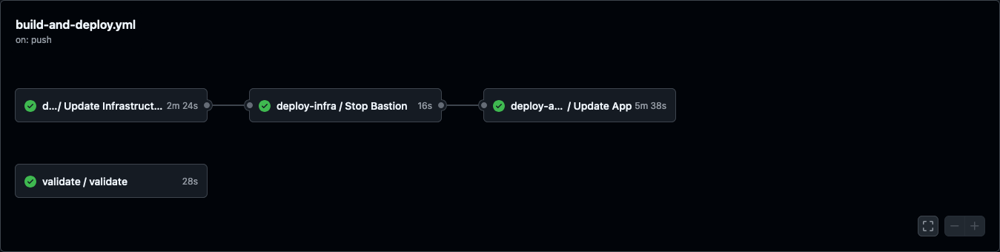

# DevOps Documentation

## Table of Contents

- [DevOps Documentation](#devops-documentation)
  - [Table of Contents](#table-of-contents)
  - [Prerequisites](#prerequisites)
    - [Administrative](#administrative)
    - [Application](#application)
    - [Data](#data)
    - [Software](#software)
      - [Debian/Ubuntu](#debianubuntu)
      - [MacOS](#macos)
  - [Configurations](#configurations)
    - [CI/CD](#cicd)
      - [`.github/workflows/*`](#githubworkflows)
      - [Deployment](#deployment)
        - [`build-and-deploy.yaml`](#build-and-deployyaml)
          - [`validation-run.yml`](#validation-runyml)
          - [`terraform-deploy-infra.yml`](#terraform-deploy-infrayml)
          - [`cloudgov-deploy-app.yml`](#cloudgov-deploy-appyml)
      - [Scheduled Pipelines](#scheduled-pipelines)
          - [`database-backup.yml`](#database-backupyml)
    - [CloudFoundry](#cloudfoundry)
      - [apt.yml](#aptyml)
      - [manifest.yml](#manifestyml)
      - [.bp-config/](#bp-config)
        - [httpd/](#httpd)
        - [php/](#php)
        - [options.json](#optionsjson)
  - [Scripts](#scripts)
    - [Application Scripts](#application-scripts)
      - [`bootstrap.sh`](#bootstrapsh)
      - [`build_static`](#build_static)
      - [`entrypoint`](#entrypoint)
      - [`post-deploy`](#post-deploy)
      - [`start`](#start)
    - [Pipeline Scripts](#pipeline-scripts)
      - [`orch/build.sh`](#orchbuildsh)
      - [`cloud-gov-deploy.sh`](#cloud-gov-deploysh)
      - [`cloud-gov-login.sh`](#cloud-gov-loginsh)
      - [`cloud-gov-remote-command.sh`](#cloud-gov-remote-commandsh)
      - [`deb-awscli.sh`](#deb-awsclish)
      - [`deb-basic-deps.sh`](#deb-basic-depssh)
      - [`deb-cf-install.sh`](#deb-cf-installsh)
      - [`deb-mysql-client-install.sh`](#deb-mysql-client-installsh)
      - [`downsync-backup.sh`](#downsync-backupsh)
      - [`downsync-restore.sh`](#downsync-restoresh)
      - [`exports.sh`](#exportssh)
      - [scheduled-backup.sh](#scheduled-backupsh)

## Prerequisites

These are general tools and requirements needed to interact with the various scripts in this repository.

### Administrative

  - Cloud.gov Spaces

    The Cloud.gov spaces should already be created. This project uses:

      - digital-gov-dev (includes dev and test)
      - digital-gov-prod
      - digital-gov-staging

    The naming convention is typically: `{project_name}-{environment_name}`.

  ### Application

  Clone of both the [application](https://github.com/usagov/digital-gov-drupal/).

  ### Data

  Obtain a copy of the latest backup archive available. This will likely have been moved to Google Drive or some other storage.

  ### Software

  #### Debian/Ubuntu

[[top]](#devops-documentation)

  - awscli

    [Instructions](https://docs.aws.amazon.com/cli/latest/userguide/getting-started-install.html)

    ```
    curl "https://awscli.amazonaws.com/awscli-exe-linux-x86_64.zip" -o "awscliv2.zip"
    unzip awscliv2.zip
    sudo ./aws/install
    ```

  - CloudFoundry CLI v8

    [Instructions](https://docs.cloudfoundry.org/cf-cli/install-go-cli.html)

    ```
    wget -q -O - https://packages.cloudfoundry.org/debian/cli.cloudfoundry.org.key | sudo apt-key add -
    echo "deb https://packages.cloudfoundry.org/debian stable main" | sudo tee /etc/apt/sources.list.d/cloudfoundry-cli.list
    sudo apt-get update
    sudo apt-get install cf8-cli
    cf install-plugin https://github.com/cloud-gov/cf-service-connect/releases/download/1.1.0/cf-service-connect-darwin-amd64
    ```

  - jq

    ```
    sudo apt install jq
    ```

  - mysql-client

    ```
    apt-get install mysql-client
    ```

  - OpenTofu (Terraform)

    [Instructions](https://opentofu.org/docs/intro/install/deb/)

    ```
    # Download the installer script:
    curl --proto '=https' --tlsv1.2 -fsSL https://get.opentofu.org/install-opentofu.sh -o install-opentofu.sh
    # Alternatively: wget --secure-protocol=TLSv1_2 --https-only https://get.opentofu.org/install-opentofu.sh -O install-opentofu.sh

    # Give it execution permissions:
    chmod +x install-opentofu.sh

    # Please inspect the downloaded script

    # Run the installer:
    ./install-opentofu.sh --install-method deb

    # Remove the installer:
    rm -f install-opentofu.sh
    ```

  [[top]](#devops-documentation)
  #### MacOS

  - Homebrew

    [Instructions](https://brew.sh)

    ```
    /bin/bash -c "$(curl -fsSL https://raw.githubusercontent.com/Homebrew/install/HEAD/install.sh)"
    ```

    NOTE: `sudo` rights are need on the laptop to install `homebrew`, otherwise permissions will be incorrect.

    - awscli

      [Instructions](https://docs.aws.amazon.com/cli/latest/userguide/getting-started-install.html)

      ```
      brew install awscli
      ```

     - CloudFoundry CLI v8

       [Instructions](https://docs.cloudfoundry.org/cf-cli/install-go-cli.html)

       ```
       brew install cloudfoundry/tap/cf-cli@8
       cf install-plugin https://github.com/cloud-gov/cf-service-connect/releases/download/1.1.0/cf-service-connect-darwin-amd64
       ```

     - coreutils

       ```
       brew install coreutils
       ```

     - jq

       ```
       brew install jq
       ```

     - mysql-client

       ```
       brew install mysql-client
       ```

     - Terraform

       [Instructions](https://opentofu.org/docs/intro/install/homebrew/)

       ```
       brew install opentofu
       ```

## [Configurations](#configurations)

[[top]](#devops-documentation)
### [CI/CD](#githubactions)

This repository uses GitHub Actions as it's CI/CD pipeline.

#### `.github/workflows/*`

These files contains the Github Action `jobs` and `workflows` that make up the CI/CD pipeline. View the [Understanding GitHub Actions](https://docs.github.com/en/actions/about-github-actions/understanding-github-actions) to learn more.

#### Deployment

The following are the workflows for deployments.

***NOTE: OpenTofu is used instead of Terraform due to the license changes to Terraform in 2024.  When Terraform is being mentioned, this project uses OpenTofu.***

##### `build-and-deploy.yaml`

This workflow is a parent workflow that will deploy Tterraform infrastructure and the Drupal application.



###### `validation-run.yml`
This workflow is triggered from the `build-and-deploy.yaml` workflow above. This workflow runs validation testing, such as running `Robo`.

###### `terraform-deploy-infra.yml`

This workflow is triggered from the `build-and-deploy.yaml` workflow above. This workflow does the following:

  - `updateInfrastucture`
    1. Clone the repository.
    1. Configure env vars in runner.
    1. Downloads dependencies (i.e. apt deps, Cloudfoundry CLI, etc.)
    1. Login to Cloud.gov.
    1. Start the Terraform bastion.
    1. Sends remote commands to the bastion to clone the repo.
    1. Build the modsecurity plugin for the NGINX version in buildpack.
    1. Configures Terraform file `terraform.tfvars`.
    1. Sends remote command `terraform init`.
    1. Send remote command  `terraform validate`.
    1. Send remote command  `terraform plan`.
    1. Send remote command  `terraform apply -auto-approve`.
  - `stopBastion`
    1. Stop the Terraform bastion.

###### `cloudgov-deploy-app.yml`
This workflow is triggered from the `build-and-deploy.yaml` workflow above. This workflow does the following:

  - `updateApp`
    1. Clone the repository.
    1. Configure env vars in runner.
    1. Downloads dependencies (i.e. apt deps, Cloudfoundry CLI, etc.)
    1. Login to Cloud.gov.
    1. Build the Drupal theme using node.
    1. Deploy the app with the `manifest.yml`.
    1. Run post deploy commands (i.e. drush cr, etc.)

#### Scheduled Pipelines

###### `database-backup.yml`
This work flow will run a database backup at midnight for each of the protected branches in the repository.
  - `startBastion`
    1. Clone the repository.
    1. Configure env vars in runner.
    1. Downloads dependencies (i.e. apt deps, Cloudfoundry CLI, etc.)
    1. Login to Cloud.gov.
    1. Start the database backup bastion.
  - `backup-database`
    1. Clone the repository.
    1. Configure env vars in runner.
    1. Downloads dependencies (i.e. apt deps, Cloudfoundry CLI, etc.)
    1. Login to Cloud.gov.
    2. Create SSH tunnel to database to backup the database and upload it to S3 backup bucket.
  - `stopBastion`
    1. Stop the database backup bastion.

[[top]](#devops-documentation)
### [CloudFoundry](#cloudfoundry)

#### [apt.yml](#aptyml)

This yaml is read by the [apt buildpack](https://github.com/cloudfoundry/apt-buildpack) during the CloudFoundry staging process. It allows the installation of additional packages from Debian and Ubuntu repositories before the application is deployed.

In this repository, it is used to run an updated version of the NewRelic agent.

#### [manifest.yml](#manifestyml)

This yaml has the configuration for the actual application to be ran.

In this repository, it is used to deploy an instance of the Drupal CMS.

#### [.bp-config/](#bp-config)

This directory has additional configuration settings for the [php buildpack](https://github.com/cloudfoundry/php-buildpack).

##### [httpd/](#httpd)

This directory has configuration settings for Apache.

  - `http.conf`: located in the root directory, this configuration file can be used to override global web server configuration options.
  - `user-provided/`: this directory holds additional configurations.
      - `httpd-drupalsupport.conf`: loads additional Apache modules for the Drupal instance to function.

##### [php/](#php)

This directory has configuration settings for PHP.

  - `php.ini.d/`: this directory automatically loads additional PHP settings during PHP initialization.
      - `extensions.ini`: this configuration file loads additional PHP modules required for the site to function. This includes `pdo_mysql` for MySQL connectivity and `sodium` (aka `libsodium`) for encryption support. To find additional modules that are supported, [check this file](https://github.com/cloudfoundry/php-buildpack/blob/master/manifest.yml). Scroll down the the version of PHP you are utilizing, and look for the `dependencies` section.
      - `memory_limit.ini`: this configuration file will set the maximum amount of memory that PHP can consume.

##### [options.json](#optionsjson)

This configuration includes additional bootstrapping options for the `php-buildpack`.

  - `PHP_VERSION`: This field uses a special variable (i.e. `{PHP_##_LATEST}`). For valid variable names, [check this file](https://github.com/cloudfoundry/php-buildpack/blob/master/defaults/options.json).
  - `ADDITIONAL_PREPROCESS_CMDS`: This array of strings are the paths to scripts to be ran before the system is deployed, during the staging process. Currently, this runs [bootstrap.sh](#bootstrapsh).


## Scripts

[[top]](#devops-documentation)
### Application Scripts

The are scripts that are ran in the application container while it's running in the cloud.gov environment.

#### `bootstrap.sh`

Runs configurations during the build pack staging. This includes things such as  the installation of `awscli`.

#### `build_static`

Compiles the static website via the Drupal Tome module, then syncs the newly generated static files via `awscli` to S3. This script runs as a scheduled pipeline, where it is launched as a CloudFoundry task in cloud.gov.

#### `entrypoint`

A simple script that is used to hold the container open with a infinite sleep loop.

#### `post-deploy`

Used to do post deployment house keeping tasks. These include various `drush` commands, such as running cache rebuild, config import, and the s3fs module tasks.

#### `start`

Used to start the PHP and Apache processes. It will then run [entrypoint](#entrypoint).

[[top]](#devops-documentation)
### Pipeline Scripts

These are the scripts that are to be utilized by the pipeline.

#### `orch/build.sh`

Installs dependencies and builds the Drupal theme. The generated theme is then uploaded with the build pack.

#### `cloud-gov-deploy.sh`

Deploys the Drupal application by pushing `manifest.yml`. The script uses the `envsubst` command to replace environment variables in `manifest.yml` with environment specific variables that are stored as runner environmental variables.

After the application is deployed, it will setup network connections to and from the WAF to the application.

#### `cloud-gov-login.sh`

Logins into a cloud.gov organization and space using the pipeline credentials.

#### `cloud-gov-remote-command.sh`

Uses `cf-cli` to SSH to an application and run a command. Equivalent of `ssh USER@HOST 'COMMAND'`.

#### `deb-awscli.sh`

Installs the `aws-cli` to the pipeline. Used for the [scheduled_backup.sh](#scheduled_backupsh) to transfer files between the various S3 buckets used.

#### `deb-basic-deps.sh`

Installs basic dependencies, like `envsubst` in the `gettext` package, used by several scripts. Additional basic dependencies that multiple scripts use can be added here.

#### `deb-cf-install.sh`

Installs the `cf-cli` binaries and dependencies. Used to run the CloudFoundry commands to interact with the Cloud.gov platform.

#### `deb-mysql-client-install.sh`

Installs the `mysql-client` package. This is used for [downsync-backup.sh](#downsync-backupsh) and [downsync-restore.sh](#downsync-restoresh).

#### `downsync-backup.sh`

Launched by a `triggered pipeline` that will connect to the database and executes the `mysqldump` command to get a current copy of the database running in an environment.

#### `downsync-restore.sh`

Launched by a `triggered pipeline` that will connect to the database and executes the `mysql` command to restore a database running in an environment.

#### `exports.sh`

Certain variables are environmentally dependent, like the application's memory.

#### scheduled-backup.sh

Launched by a `triggered pipeline` in CircleCI, this scripts gathers all S3 bucket resources, along with a database back and packages them into a single archive.

[[top]](#devops-documentation)

