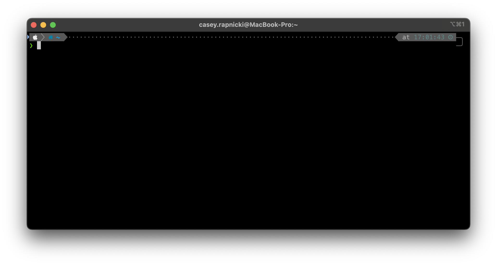
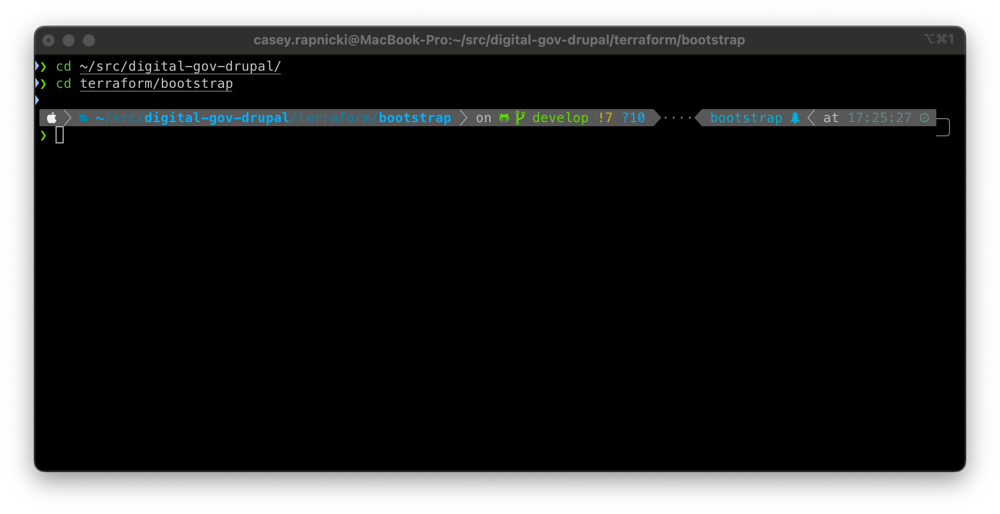
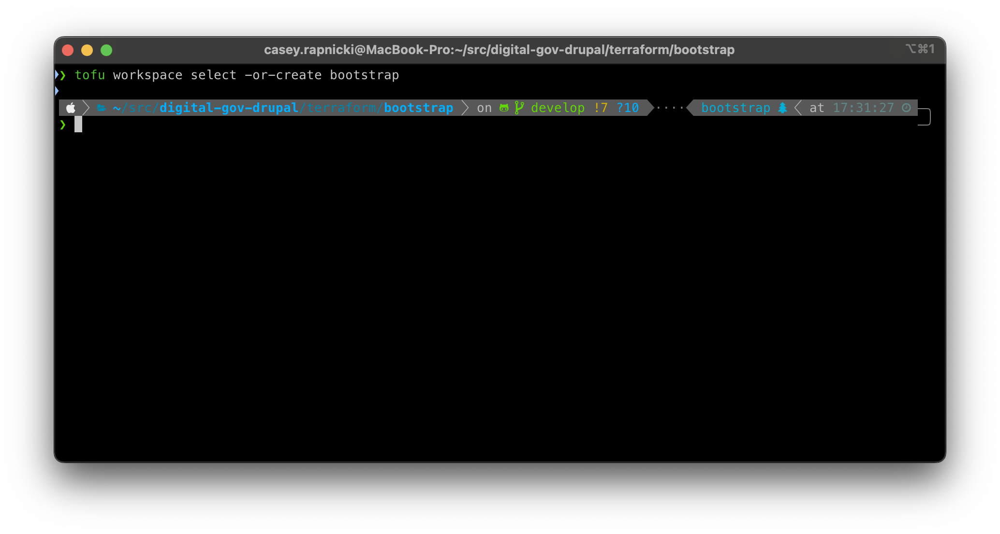
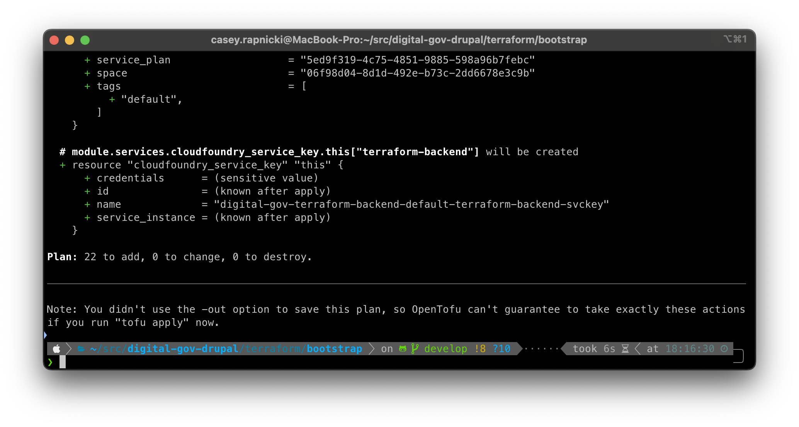
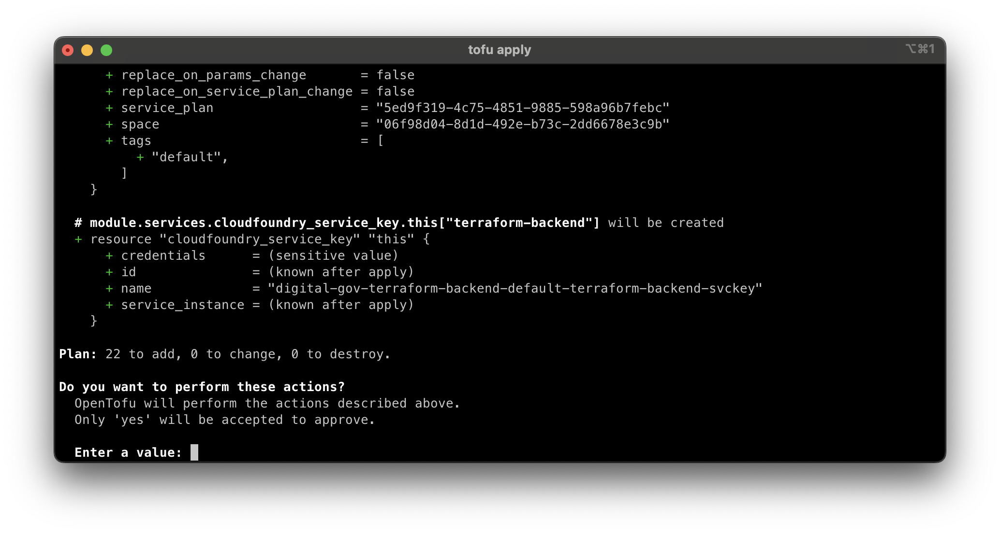
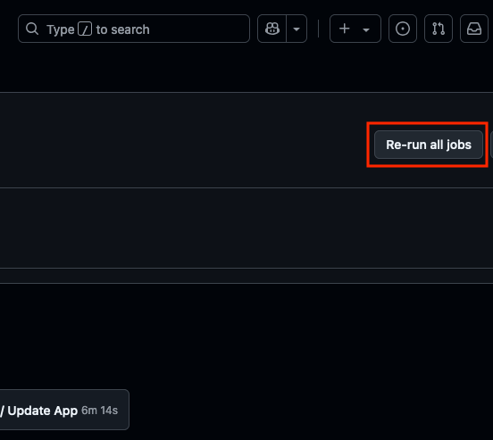

# Disaster Recovery

## Table of Contents

- [Disaster Recovery](#disaster-recovery)
  - [Table of Contents](#table-of-contents)
  - [Prerequisites](#prerequisites)
  - [Restore Process](#restore-process)
    - [Bootstrap](#bootstrap)
    - [Restore Data](#restore-data)
      - [Database](#database)

## Prerequisites

View the prerequisites and required tools for using scripts in the [devops.md](devops.md) file, in the `Prerequisites` section.

## Restore Process

  This section outlines the restoration process from a backup.

### Bootstrap

[[top]](#disaster-recovery)

If the entire account was deleted, you will need to run the steps in this section.

***NOTE: A Cloud.gov organization and spaces will need to be created before you can begin this process. One of the Federal leads on the project should know how to make this request and expedite it. However, if this is a larger scale issue, affecting many accounts and organizations, there might not be much that can be done to speed this process up.***

The `bootstrap` process will set various secrets in `Github` for use with `Github Actions` pipelines, while also creating a Terraform bastion and a PostgresSQL Micro RDS instance in your production space.  The PostgresSQL database is used as a remote state for the Terraform state file.

1. Login to Cloud.gov.

```bash
cf login -a api.fr.cloud.gov  --sso
```

2. Clone the respository to your local drive with:
   
```bash
git clone https://github.com/GSA/digital-gov-drupal.git
cd digital-gov-drupal
```

3. Copy `terraform.tfvars` from the Google Drive backup and place it in the `./terraform/bootstrap` directory.
    
```bash
cd ./terraform/bootstrap
```
4. Create a service account. Create this account in the production space (in the example below, it's called `prod`). This account is used for pipeline deployments but also needed for the bootstrapping process. Run the following Cloudfoundry CLI command:
  
```bash
cf target -s prod
bash create_service_account.sh
```

The `create_service_account.sh` will create a pipeline service account user and give it `SpaceDeveloper` permissions for all the spaces in your organization.

***NOTE: Replace `prod` with the name of your production environment, if it's different.***

The resulting output will look like:

```json
{
  "credentials": {
    "password": "sM@4AdFQGhZ2V/9ejfnp3b",
    "username": "517d12c0-86f5-4414-8bf4-dd6afa20d4ca"
  }
}
```

***NOTE: The credentials above are random and will not work with any Cloud.gov environment.***

5. Open a terminal window.



6. From the root of the cloned git repository, change directory to `./terraform/bootstrap`.



7. Change the Terraform workspace to the `bootstrap` workspace: `tofu workspace select -or-create bootstrap`



8. Run the init: `tofu init`
 


9. Run the plan: `tofu plan`
  


10.  Run the plan: `tofu apply`, entering `yes` to apply the changes.



[[top]](#disaster-recovery)

Restoring the environment is a matter of running a deployment pipeline for the environment you want to restore.  The pipeline being triggered will run the `terraform-deploy-infra.yml` workflow, deploying the WAF, RDS database, and S3 buckets needed for the environments.  This step will take around 10-15 minutes, the longest process being the creation of the RDS database.  After the infrastucture is created, `cloudgov-deploy-app.yml` will be triggered and will redeploy the Drupal application. Triggering the deployment pipeline can be done one of two ways:

1. Find the last successful deployment of the last code merge and re-run the pipeline by clicking the `Re-run all jobs` button.


1. Make an arbitrary change to the Git code and merge the changes to branch of the environment you want to restore.

2. Create any external domains that need be created. For the production **static** site, you will want to create it with the `domain-with-cdn` plan. You can find the instructions to do that in Cloud.gov [here](https://cloud.gov/docs/services/external-domain-service).

***NOTE: You probably don't want the CDN with the Drupal site. The CDN can cache logged in credentials in certain cases.***

### Restore Data

#### Database

To restore the Drupal database, find the latest copy of the database in the GSA Google Drive and copy it to your local hard drive. Rename that database to `database_restore.sql.tar.gz` and upload it to the backup S3 bucket.  Next manually trigger the database restore pipeline on the branch you want to restore the database to.